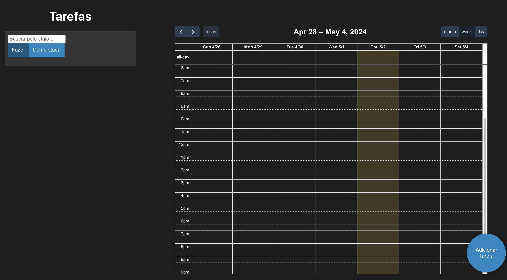
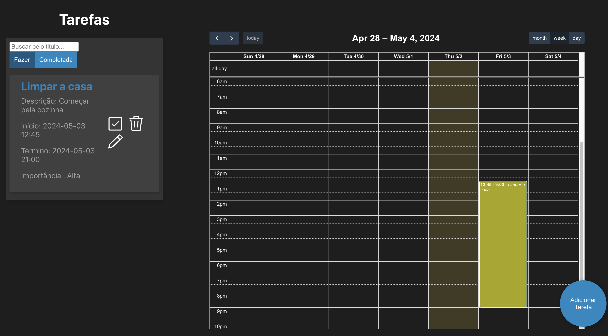

# README - Aplicativo de Lista de Tarefas

## Visão Geral

Este é um aplicativo web de Lista de Tarefas construído usando React. Ele permite aos usuários gerenciar suas tarefas, incluindo adicionar novas tarefas, editar as existentes, marcar tarefas como concluídas e filtrar tarefas com base no título da tarefa.

## Funcionalidades

1. **Gerenciamento de Tarefas**:
   - Adicionar novas tarefas com título, descrição, data de início, data de término e nível de importância.
   - Editar tarefas existentes para atualizar seus detalhes.
   - Marcar tarefas como concluídas ou retornar tarefas concluídas para a lista ativa.

2. **Filtragem e Busca**:
   - Filtrar tarefas com base em seus títulos e buscar tarefas específicas usando uma barra de busca.
   - Alternar entre visualizações de tarefas ativas e concluídas.

3. **Calendário Interativo**:
   - Visualizar tarefas em formato de calendário usando o plugin FullCalendar.
   - Navegar por diferentes visualizações de calendário (mês, semana, dia).

4. **Interface de Usuário**:
   - Design de UI limpo e intuitivo.
   - Modal para adicionar novas tarefas com validação de formulário.
   - Exibição de tooltips para detalhes das tarefas.

## Tecnologias Utilizadas

- React: Biblioteca JavaScript frontend para construção de interfaces de usuário.
- FullCalendar: Biblioteca JavaScript de calendário de eventos para exibir tarefas em formato de calendário.
- Date-fns: Biblioteca utilitária JavaScript para formatação de datas.
- Tippy.js: Biblioteca de tooltips para exibir detalhes das tarefas.
- React Icons (ícones Go): Biblioteca de ícones para elementos de interface.
- HTML/CSS: Estrutura e estilização do aplicativo web.
- Local Storage: Armazenamento no navegador para persistência dos dados das tarefas.

## Como Executar

1. Clone este repositório em sua máquina local.
2. Navegue até o diretório do projeto.
3. Instale as dependências usando `npm install` ou `yarn install`.
4. Inicie o servidor de desenvolvimento com `npm start` ou `yarn start`.
5. Acesse o aplicativo em seu navegador em `http://localhost:3000`.

## Exemplo
 
  
 
